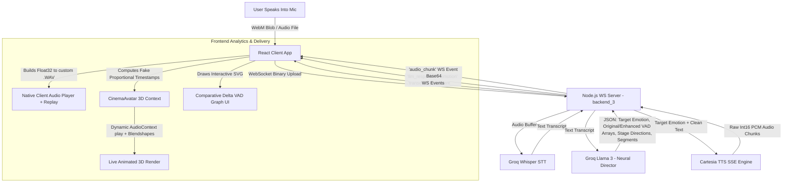

# AIvora: 3D Real-Time Cinematic Avatar Pipeline

AIvora is a bleeding-edge, real-time emotion and dialogue engine. It captures raw human vocal performance, extracts complex acoustic subtexts and emotions using ultra-fast LLMs, and synthesizes an intelligent, emotionally-aware response. The system natively performs continuous side-by-side emotional analytics and streams the generated response directly into a fully lip-synced 3D interactive Avatar over a single WebSocket connection. 

 

## 🏗️ Architecture & Tree

The project is built on a highly optimized, state-of-the-art **WebSockets + React 3D** model.

```bash
AIvora/
├── Client/                     # React Frontend (Vite)
│   ├── public/                 
│   │   └── index.html          # importmaps for Three.js & CDN Modules
│   └── src/
│       ├── components/         
│       │   ├── CinemaAvatar.jsx # Core 3D React wrapper for TalkingHead, handles Word/Viseme mapping
│       │   ├── LandingPage.jsx  # Hero UI and statistics
│       │   └── ParticleBackground.jsx # UI VFX
│       ├── App.jsx             # Main logic: WebSocket Receiver, Analytics Dashboard & Graphing Engine
│       ├── main.jsx
│       └── App.css             # Glassmorphism & UI animations
│
├── backend_3/                  # Current Real-Time Node.js Backend
│   ├── src/
│   │   ├── server.js           # Core WS & Express HTTP Server
│   │   ├── controllers/
│   │   │   └── audioController.js # Handles Socket sessions & WS Routing
│   │   ├── services/
│   │   │   ├── audioService.js    # Groq-powered STT (Whisper)
│   │   │   ├── llmService.js      # Llama-3 Synthesizes dialogue AND outputs predictive JSON Analysis
│   │   │   └── ttsService.js      # Cartesia Real-Time SSE TTS stream (with custom emotional timing/speed tags)
│   │   └── utils/
│   ├── package.json
│   └── .env                    # Cartesia, Groq API Keys
```

## 🌊 Complete Pipeline Flowchart

The system functions in **zero-latency streaming mode**, taking advantage of the `Int16Array` Base64 multiplexing approach across WebSockets.



## 🚀 Setup & Execution

You will need two terminal sessions running concurrently to use the current AIvora stack.

### 1. Start the Real-Time Server (`backend_3`)
You must populate `backend_3/.env` with your API keys:
- `GROQ_API_KEY` (For blistering fast STT and LLM processing)
- `CARTESIA_API_KEY` (Required for the `ttsService` to emit high-speed socket chunks)

```bash
cd backend_3
npm install
npm run start 
# -> Server starts on ws://localhost:8080
```

### 2. Start the Frontend (`Client`)

```bash
cd Client
npm install
npm run dev
# -> Starts on http://localhost:5173
```

## 🧠 Key Features Implemented

1. **Delta Analytics Dashboard:** AIvora provides a side-by-side comparison of the Human user's generated VAD (Valence, Arousal, Dominance) vectors stacked seamlessly against the AI's synthesized response via a dynamically rendered SVG vector canvas.
2. **Proportional Viseme Lip-sync:** Because Cartesia TTS lacks real-time API streaming for word-level timestamps, AIvora's `CinemaAvatar` reconstructs a predictive timeline using proportional byte-duration distributions. This forcibly tricks `talkinghead.mjs` into synchronizing its visemes flawlessly with live Float32 buffers.
3. **Pacing Matrix Injection:** The Cartesia engine has been meticulously mapped mapping emotions to semantic speed modifiers (`"slow"`, `"fast"`, `"slowest"`) using `__experimental_controls` to provide heavy dramatic timing exactly when AIvora detects contradictory emotional subtext. 
4. **Master Native Audio Pipeline:** Rather than immediately dropping the raw arrays after the buffer flush, AIvora maintains a clean state `Replay Avatar` hook, enabling the user to natively download (`.WAV`) or echo the exact cached rendering sequence cleanly outside of React's StrictMode double-fire state update ecosystem.
