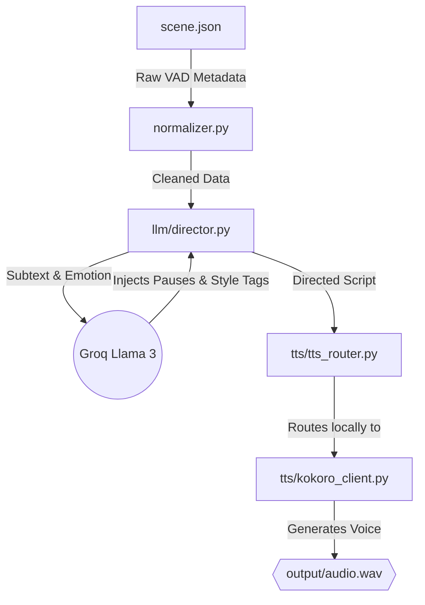

# Voice Branch Pipeline

This repository contains an emotionally-aware speech synthesis pipeline ("The Voice Branch"). It processes structured performance data (such as emotional tags and subtext), uses an LLM to inject acting directions into the script, and then routes that script to a Text-To-Speech (TTS) engine.

## System Workflow



## Final File Structure (After Kokoro Integration)

```text
voice_branch/
├── .env                        # Stores API keys (Groq)
├── README.md                   # This file
├── requirements.txt            # Python dependencies (kokoro, torch, soundfile)
├── scene.json                  # Input dialogue and VAD variables
├── normalizer.py               # Pydantic validation for input blocks
├── context/
│   └── state_tracker.py        # Tracks conversational history
├── formatter/
│   └── voice_param_mapper.py   # Maps semantic tags to TTS variables
├── llm/
│   └── director.py             # Calls Groq to write acting tags
├── pipeline/
│   └── run_voice.py            # Main Orchestrator -> `python -m pipeline.run_voice`
├── tts/
│   ├── tts_router.py           # Routes finalized script to local TTS
│   └── kokoro_client.py        # The offline Kokoro AI generation client
└── output/                     # Saved .wav audio files
```

---

## Moving to Local Offline TTS (Kokoro)

Currently, the pipeline relies on paid cloud APIs. To transition to a completely free, fast, and local deep-learning AI voice, we will integrate **Kokoro TTS**.

### 1. Installation

To set up Kokoro locally, you will need to install PyTorch and the Kokoro Python package. Be aware that PyTorch is a large dependency (~2.5 GB).

```bash
pip install kokoro>=0.9.4 soundfile torch
```

*Note: The first time you run Kokoro, it will automatically download its model weights (~200MB) from HuggingFace to your machine.*

### 2. Files to Change

Once the libraries are installed, you need to modify the following areas within this repository to complete the offline integration:

1. **Create `tts/kokoro_client.py`**: 
   - Create this new client to initialize the Kokoro pipeline (`KPipeline`).
   - Write a `generate(text, params, filename)` function that passes the LLM-enhanced text to Kokoro using a fast expressive voice (like `af_heart` or `af_bella`).
   - Save the raw audio chunks outputted by the model into a `.wav` file using the `soundfile` library.

2. **Update `tts/tts_router.py`**:
   - Change the import statement at the top to import the new `kokoro_client.py` instead of the OpenAI or ElevenLabs clients.
   - Inside `route_tts()`, update the routing logic to pass the generated `filename` and `directed` text directly into `kokoro_generate()`. 

3. **(Optional) Update `formatter/voice_param_mapper.py`**:
   - Adjust the mapping logic to output parameters specific to Kokoro voices (e.g., changing voice IDs or adjusting `speed` multipliers) based on the input emotion.

Once these changes are made, running `python -m pipeline.run_voice` will synthesize expressive voices instantly right on your own hardware!
