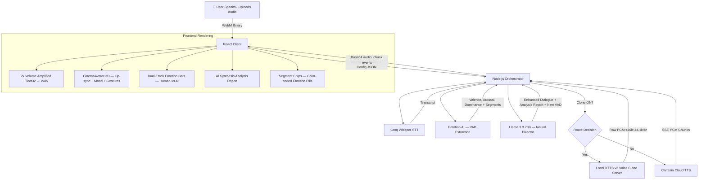

# AIvora — Neural Emotion Cinema Engine

> Real-time 3D avatar that listens to your voice, detects raw human emotion, rewrites your dialogue with cinematic intensity, clones your voice, and performs it back — all in one seamless WebSocket pipeline.


---

## ✨ What It Does

1. **You speak** into your microphone (or upload an audio file)
2. AIvora **transcribes** your voice in real-time via Groq Whisper
3. A dedicated **Emotion AI** extracts Valence, Arousal, Dominance vectors and per-sentence sentiment segments
4. **Llama 3.3 70B** rewrites your dialogue to be cinematically expressive — injecting stutters, pauses, emphasis, and stage directions while generating a comparative **Synthesis Analysis Report**
5. Your rewritten dialogue is **spoken back** using either:
   - 🔊 **Local XTTS v2 Voice Clone** — clones YOUR voice from the recording
   - ☁️ **Cartesia Cloud TTS** — ultra-fast cloud synthesis with emotion controls
6. A **3D Avatar** lip-syncs and emotes the performance in real-time
7. A full **Analytics Dashboard** visualizes the emotional transformation with dual-track progress bars and AI-generated comparative analysis

---

## 🏗️ Architecture

```
AIvora/
├── Client/                          # React + Vite Frontend
│   └── src/
│       ├── App.jsx                  # Core: WebSocket, Analytics Dashboard, Audio Pipeline
│       ├── App.css                  # Glassmorphism, Skeuomorphic UI, Animations
│       ├── CharacterFace.jsx        # SVG Emotion Face (sidebar indicator)
│       └── components/
│           ├── CinemaAvatar.jsx     # 3D TalkingHead wrapper — lip-sync, mood, gestures
│           ├── LandingPage.jsx      # Cinematic hero landing with live stats
│           └── ParticleBackground.jsx # Ambient particle VFX layer
│
├── backend_3/                       # Node.js Real-Time Orchestrator
│   └── src/
│       ├── server.js                # Express + WebSocket server (port 8080)
│       ├── controllers/
│       │   └── audioController.js   # Session management, config toggle, WS routing
│       ├── orchestrator/
│       │   └── pipeline.js          # 3-step pipeline: STT → LLM → TTS
│       ├── services/
│       │   ├── whisperService.js    # Groq Whisper STT (ultra-fast transcription)
│       │   ├── emotionService.js    # Groq LLM emotion extraction (VAD + segments)
│       │   ├── llmService.js        # Llama 3.3 70B dialogue enhancer + analysis report
│       │   └── ttsService.js        # Dual-route: Local XTTS clone OR Cartesia cloud
│       └── config/
│           └── .env                 # API keys (GROQ_API_KEY, CARTESIA_API_KEY)
│
└── voice_clone/                     # Python XTTS v2 Micro-Server
    ├── tts_server.py                # Flask server (port 5000) — voice cloning endpoint
    └── .venv/                       # Python 3.10 virtual environment
```

---

## 🌊 Pipeline Flow



---

## 🚀 Setup & Execution

You need **three terminals** running concurrently.

### Prerequisites

- **Node.js** ≥ 18
- **Python** 3.10 (for XTTS voice cloning)
- **FFmpeg** installed and on PATH
- API Keys: `GROQ_API_KEY` (required), `CARTESIA_API_KEY` (optional, for cloud TTS)

### 1. Backend Server

```bash
cd backend_3
npm install
# Create .env with your keys:
# GROQ_API_KEY=gsk_...
# CARTESIA_API_KEY=sk_car_... (optional)
npm run start
# → WebSocket server on ws://localhost:8080
```

### 2. Frontend Client

```bash
cd Client
npm install
npm run dev
# → http://localhost:5173
```

### 3. Voice Clone Server (Optional — for local cloning)

```bash
cd voice_clone

# First-time setup:
python -m venv .venv
.\.venv\Scripts\activate          # Windows
pip install TTS flask torch torchaudio

# Run:
.\.venv\Scripts\python.exe tts_server.py
# → Flask server on http://localhost:5000
```

> **Note:** XTTS v2 model downloads ~1.8GB on first launch. CPU inference takes 60–120s per generation. GPU (CUDA) is significantly faster.

---

## 🧠 Key Features

### 🎭 Dual-Route Voice Synthesis
A toggle in the UI switches between **Local XTTS v2** voice cloning (uses YOUR recorded voice as the speaker reference) and **Cartesia Cloud TTS** (ultra-fast, emotion-controlled). The backend dynamically routes based on the toggle state sent via WebSocket config messages.

### 📊 Emotion Analytics Dashboard
A redesigned analytics panel featuring:
- **Dual-Track Progress Bars** — stacked blue (Human) and purple (AI) bars for Valence, Arousal, and Dominance showing the exact emotional shift
- **Color-Coded Segment Chips** — per-sentence emotion classification with intensity percentages
- **AI Synthesis Analysis Report** — the LLM generates a qualitative explanation of how and why it modified the emotional structure

### 🎬 Immersive Fullscreen Mode
Click the expand icon on the avatar window to enter fullscreen. The avatar occupies 80% of the viewport with a fully transparent background, revealing the animated Spline 3D scene and particle effects behind the character. A floating replay control docks in the bottom-right corner.

### 🗣️ Hyper-Expressive Dialogue Rewriting
The LLM prompt engineering forces Llama 3.3 to inject:
- **Stutters and false starts** ("I- I didn't mean to...")
- **Trailing ellipses** for hesitation ("...but I guess... it doesn't matter.")
- **Dashes** for abrupt cutoffs ("Wait— no!")
- **CAPITALIZATION** for vocal spikes and emphasis

These punctuation patterns directly influence both XTTS and Cartesia to produce emotionally rich, human-like speech with natural pauses and intonation shifts.

### 🎵 Audio Volume Amplification
The raw PCM audio stream is amplified by 100% (2x gain) with hard-clamping at ±1.0 to prevent distortion, ensuring the avatar's voice is always clearly audible.

### 🤖 3D Avatar Lip-Sync Engine
The `CinemaAvatar` component uses the TalkingHead library with proportionally generated word timestamps to achieve realistic viseme-based lip synchronization. The avatar responds to detected emotions with mood changes and gesture animations driven by stage directions.

---

## 🔧 Tech Stack

| Layer | Technology |
|-------|-----------|
| **Frontend** | React 18, Vite, Framer Motion, Lucide Icons, Tailwind CSS |
| **3D Avatar** | Three.js, TalkingHead.mjs (CDN), WebGL |
| **Background VFX** | Spline 3D, Custom Particle System |
| **Backend** | Node.js, Express, WebSocket (`ws`) |
| **Speech-to-Text** | Groq Whisper (cloud, ultra-fast) |
| **Emotion Detection** | Groq Llama 3.3 70B (structured JSON extraction) |
| **Dialogue Enhancement** | Groq Llama 3.3 70B (cinematic rewriting + analysis) |
| **Text-to-Speech** | XTTS v2 (local clone) / Cartesia AI (cloud SSE) |
| **Voice Cloning** | Coqui XTTS v2 via Flask micro-server |
| **Audio Processing** | FFmpeg (format normalization), Web Audio API |

---

## 📡 WebSocket Event Reference

| Event | Direction | Payload |
|-------|-----------|---------|
| `config` | Client → Server | `{ type: "config", useVoiceClone: bool }` |
| `transcript` | Server → Client | `{ type: "transcript", text: string }` |
| `emotion` | Server → Client | `{ type: "emotion", emotion, vad, segments }` |
| `llm_response` | Server → Client | `{ type: "llm_response", reply, enhanced_vad, enhanced_segments, analysis_report }` |
| `stage_direction` | Server → Client | `{ type: "stage_direction", directions: string[] }` |
| `tts_progress` | Server → Client | `{ type: "tts_progress", message: string }` |
| `audio_chunk` | Server → Client | `{ type: "audio_chunk", audio: base64_string }` |
| `audio_end` | Server → Client | `{ type: "audio_end" }` |

---

## 📄 License

This project was built for educational and hackathon purposes.
